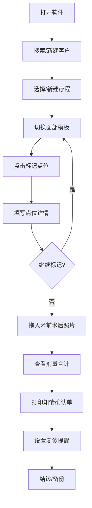

## 1. 产品概述

微整注射点位记录工具——面向单店医生的离线桌面应用，解决微整注射过程中点位无记录、剂量难追溯、术后无凭据的痛点。目标用户为小型医美机构诊室医生，追求极简操作、零学习成本、一键出单。

## 2. 核心功能

### 2.1 用户角色

| 角色 | 使用方式 | 核心权限 |
|------|----------|----------|
| 诊室医生 | 打开即用，无需注册 | 全部功能：客户管理、点位记录、打印、备份 |

### 2.2 功能模块

1. **客户列表窗口**：客户搜索（手机号/姓名）、新建客户、历史疗程列表
2. **点位画布窗口**：面部模板切换（正面/45°/侧面）、鼠标点击生成编号点位、点位备注（层次/避开血管等）、左右脸对照模式
3. **照片夹窗口**：术前术后照片拖入、按日期归档、左右脸对照展示
4. **打印预览窗口**：知情确认单生成、含点位缩略图/产品名称/总剂量/复诊日期/注意事项
5. **提醒日历窗口**：复诊日期设置、到期提醒、提醒列表管理

### 2.3 页面详情

| 页面名称 | 模块名称 | 功能描述 |
|----------|----------|----------|
| 客户列表 | 搜索栏 | 输入手机号或姓名模糊搜索客户 |
| 客户列表 | 客户卡片 | 展示客户姓名、手机号、最近就诊日期，点击进入疗程 |
| 客户列表 | 新建客户 | 填写姓名、手机号、备注，创建客户档案 |
| 客户列表 | 疗程管理 | 查看历史疗程列表，新建疗程选择项目名称 |
| 点位画布 | 模板切换 | 正面/45度/侧面三种面部轮廓SVG模板切换 |
| 点位画布 | 点位标记 | 鼠标点击面部模板生成编号点位圆圈，可拖动调整位置 |
| 点位画布 | 点位详情 | 选中点位后填写针剂名称、层次、剂量、针数、备注快捷语 |
| 点位画布 | 左右脸对照 | 切换左脸/右脸视图，分别标记点位 |
| 点位画布 | 剂量合计 | 实时计算当前疗程所有点位总剂量和总针数 |
| 照片夹 | 照片拖入 | 拖拽术前/术后照片到对应区域 |
| 照片夹 | 照片归档 | 按日期自动归档，可按日期筛选查看 |
| 照片夹 | 左右脸对照 | 照片并排展示左右脸对照 |
| 打印预览 | 知情确认单 | 生成包含点位缩略图、产品列表、总剂量、复诊日期、注意事项的打印单 |
| 打印预览 | 打印输出 | 调用浏览器打印功能输出纸质单 |
| 提醒日历 | 复诊设置 | 设置复诊日期，关联客户和疗程 |
| 提醒日历 | 到期提醒 | 启动时检查并弹出到期提醒列表 |
| 提醒日历 | 提醒管理 | 查看/删除/标记已完成提醒 |
| 全局 | 本机备份 | 一键导出所有数据为JSON文件，支持导入恢复 |

## 3. 核心流程

医生打开软件 → 搜索或新建客户 → 选择/新建疗程 → 切换面部模板 → 点击标记点位 → 为每个点位填写针剂/层次/剂量/备注 → 拖入术前术后照片 → 查看剂量合计 → 打印知情确认单 → 设置复诊提醒 → 结诊

## 4. 界面设计

### 4.1 设计风格

- 主色调：#1A1A2E（深靛蓝）配 #E8D5B7（暖米金）作为点缀，传达专业与温度
- 辅助色：#16213E（深蓝灰）、#0F3460（宝蓝）、#E94560（警示红）
- 按钮风格：圆角8px，微阴影，hover时轻微上浮
- 字体：思源黑体/Noto Sans SC，标题16px粗体，正文13px常规
- 布局风格：左侧固定画布区 + 右侧表单区，顶部Tab切换5个窗口
- 图标风格：线性图标，2px描边，与文字等高

### 4.2 页面设计概述

| 页面名称 | 模块名称 | UI元素 |
|----------|----------|--------|
| 客户列表 | 搜索栏 | 居中搜索框，带搜索图标，实时筛选 |
| 客户列表 | 客户卡片 | 左对齐卡片列表，姓名+手机号+日期，hover高亮 |
| 点位画布 | 面部模板 | SVG面部轮廓，居中显示，点位为编号圆圈 |
| 点位画布 | 药品输入区 | 右侧面板：下拉选药名、输入框填剂量/针数 |
| 点位画布 | 剂量合计 | 右侧底部固定栏，实时显示总剂量和总针数 |
| 照片夹 | 照片区域 | 左术前右术后，虚线拖入区，缩略图网格 |
| 打印预览 | 确认单 | A4纸样式的白色预览区，打印按钮悬浮右下 |
| 提醒日历 | 日历视图 | 月历网格，标记提醒日期，右侧提醒列表 |

### 4.3 响应式

- 桌面优先设计，最小宽度1280px，适配诊室桌面显示器
- 固定左侧画布区60%宽度，右侧表单区40%宽度
- 打印预览按A4纸张比例渲染

### 4.4 3D场景

不适用
