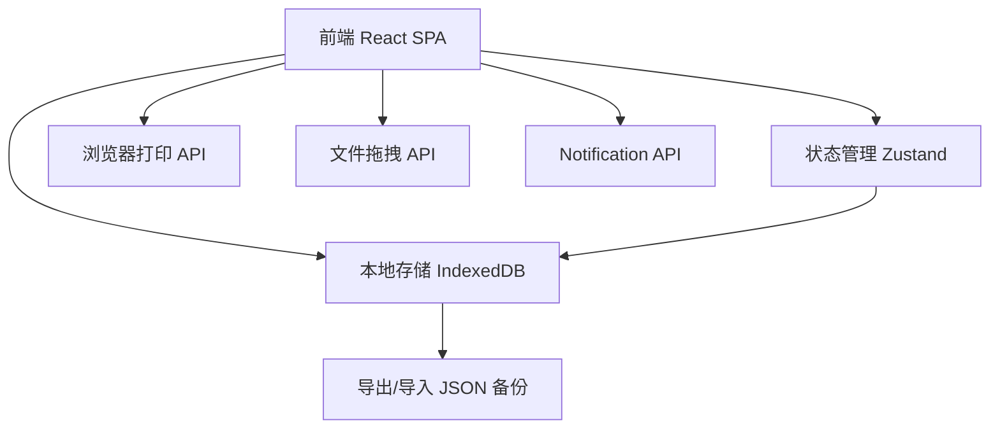
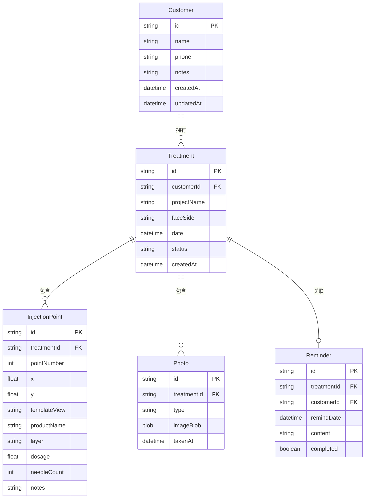

## 1. 架构设计



纯前端离线应用，无需后端服务器。所有数据存储在浏览器 IndexedDB 中，通过 JSON 文件实现本机备份与恢复。

## 2. 技术说明

- 前端：React@18 + Tailwind CSS@3 + Vite
- 初始化工具：Vite
- 后端：无（纯离线应用）
- 数据库：IndexedDB（通过 Dexie.js 封装）+ localStorage（用户偏好）
- 状态管理：Zustand
- 打印：浏览器原生 window.print() + CSS @media print
- 照片存储：IndexedDB 存储 Blob/Base64
- 备份：JSON 导出/导入

## 3. 路由定义

| 路由 | 用途 |
|------|------|
| / | 主页面，通过顶部Tab切换5个窗口模块 |

单页面应用，使用 Tab 组件切换窗口，不使用 React Router。

## 4. API 定义

无后端 API。所有数据操作通过 Dexie.js 直接读写 IndexedDB。

### 数据操作接口

| 操作 | 方法 | 说明 |
|------|------|------|
| 客户CRUD | db.customers | 增删改查客户信息 |
| 疗程CRUD | db.treatments | 增删改查疗程信息 |
| 点位CRUD | db.points | 增删改查注射点位 |
| 照片CRUD | db.photos | 增删改查照片Blob |
| 提醒CRUD | db.reminders | 增删改查复诊提醒 |
| 备份导出 | exportAll() | 导出全部数据为JSON |
| 备份导入 | importAll() | 从JSON恢复数据 |

## 5. 服务器架构

不适用（纯前端离线应用）

## 6. 数据模型

### 6.1 数据模型定义



### 6.2 数据定义语言

```sql
-- IndexedDB 通过 Dexie.js 定义 Schema
-- 版本号: 1

customers: "++id, name, phone, notes, createdAt, updatedAt"
treatments: "++id, customerId, projectName, faceSide, date, status, createdAt"
injectionPoints: "++id, treatmentId, pointNumber, x, y, templateView, productName, layer, dosage, needleCount, notes"
photos: "++id, treatmentId, type, imageBlob, takenAt"
reminders: "++id, treatmentId, customerId, remindDate, content, completed"
```
